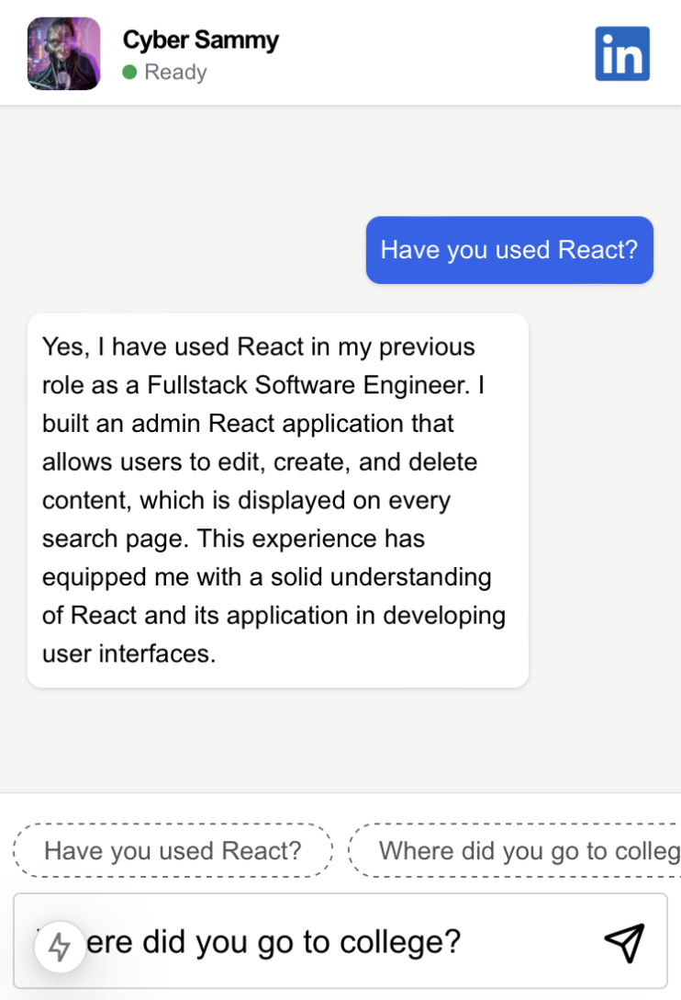

# CyberSammy

## Summary

This is a chat bot that is focused on answering questions about my resume and job experience. It utilizes the tools from terminal to chunk, embed, retrieve, and generate streaming responses. 

## Get Started

### Backend

#### Ingest Data

Ensure you have the database setup (review root level README).

Navigate to the backend of our application
```
cd backend
```

Set up the python virtual env
```
cd examples/cybersammy/backend && python -m venv venv && source venv/bin/activate && pip install -r requirements.txt
```

Add `.env` for our backend
```
OPENAI_API_KEY=<insert key>
DATABASE_URL=<insert db url>
FRONTEND_ORIGIN=http://localhost:3000
```

Ingest PDF(s)
```
from .db.ingestor import ResumeIngestor
ingestor = ResumeIngestor()

ingestor.ingest('documents')
```

This will update our vector database with data.

#### Start the API

```
fastapi dev api/main.py
```

### Frontend

Navigate to the frontend app
```
cd frontend 
```

Create `.env`
```
NEXT_PUBLIC_CHAT_API=http://localhost:8000/api/chat
```

Run the Next JS App
```
npm run dev
```

Your frontend should be available at http://localhost:3000
