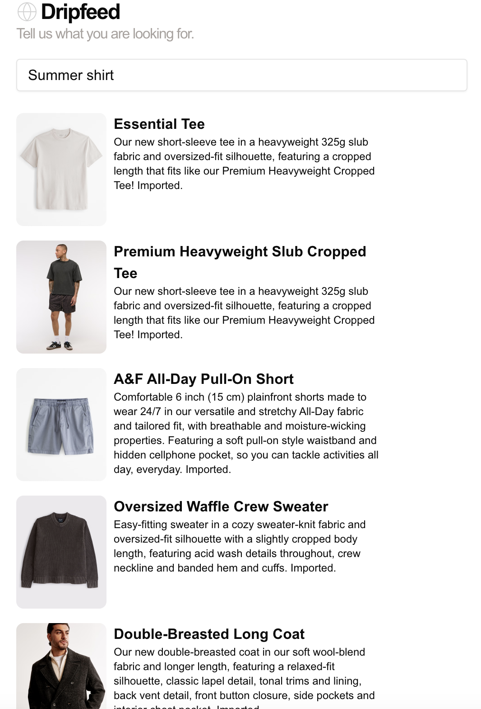
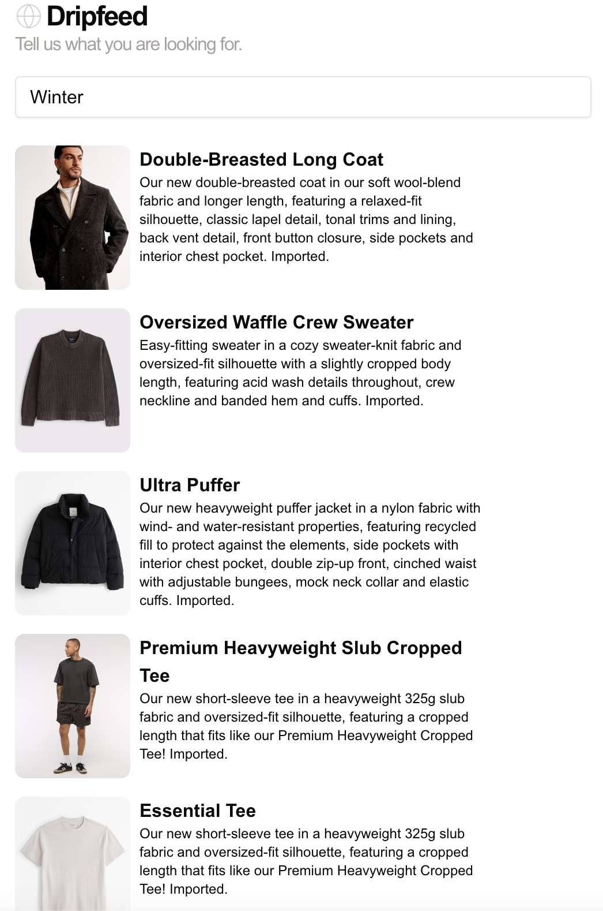

# Drip Feed

## Summary

Dripfeed is an MVP of a database of vectorized products, allowing users to explore products and similar products.

## Sample

## Scope

### Product details page

1. Allow the user to describe which product they are looking for
2. View the product, and render the details of that product (including pictures)
3. Suggest other products similar to the product this page is for
4. (Optional): Create a nice swiping UX for this
5. (Optional): Create a localzied version of the product (i.e. products are for local shops, and drive foot traffic)

Pages
- Search page: takes query, returns leading results based on descriptions
- Detail page: looks up product, fetches similar products based on descriptions and attributes

API
- /api/related, process query and find 5 related products

Services
- (optional) Ingestion: take picture of product, and create description

Similar products: 
1. Descriptions are relatively similar 
2. Colors (estimated on Hue values) 
3. Type (Jacket, pants, long sleeve shirt, etc)
 